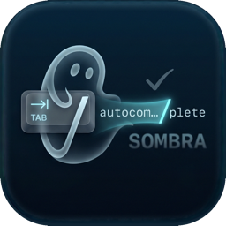
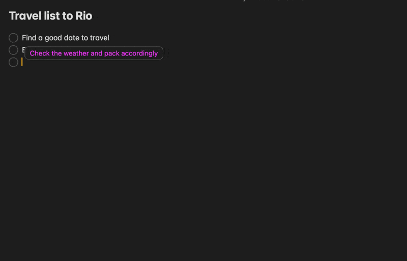
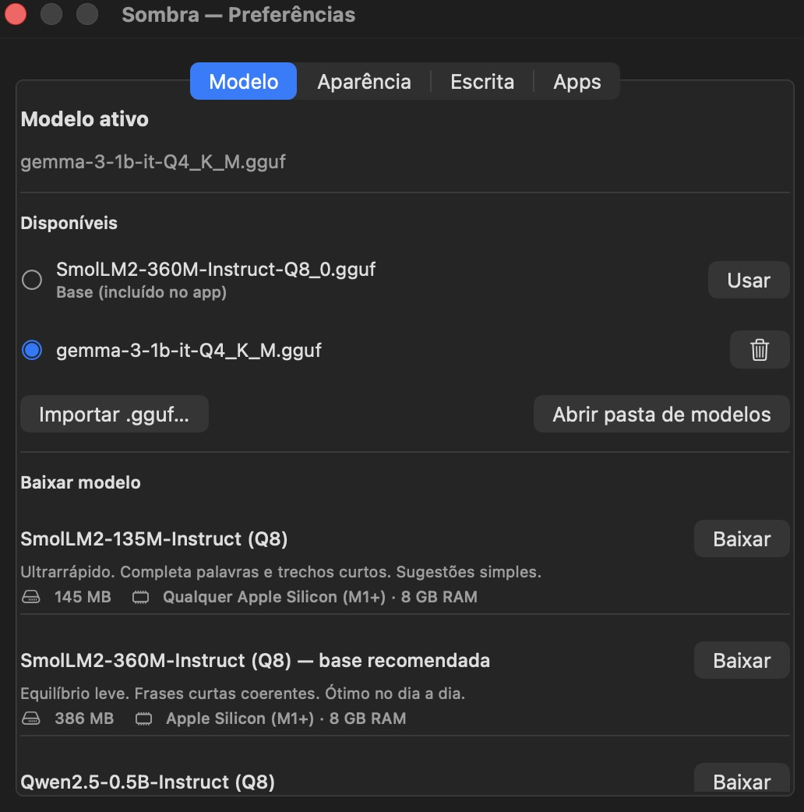
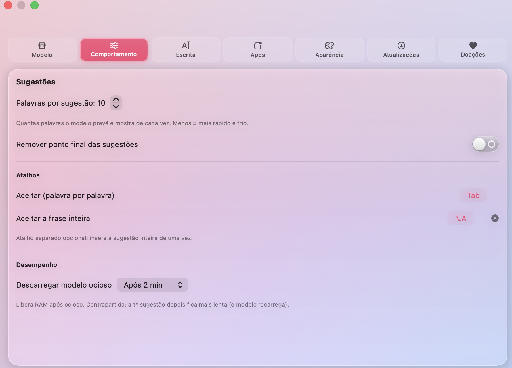
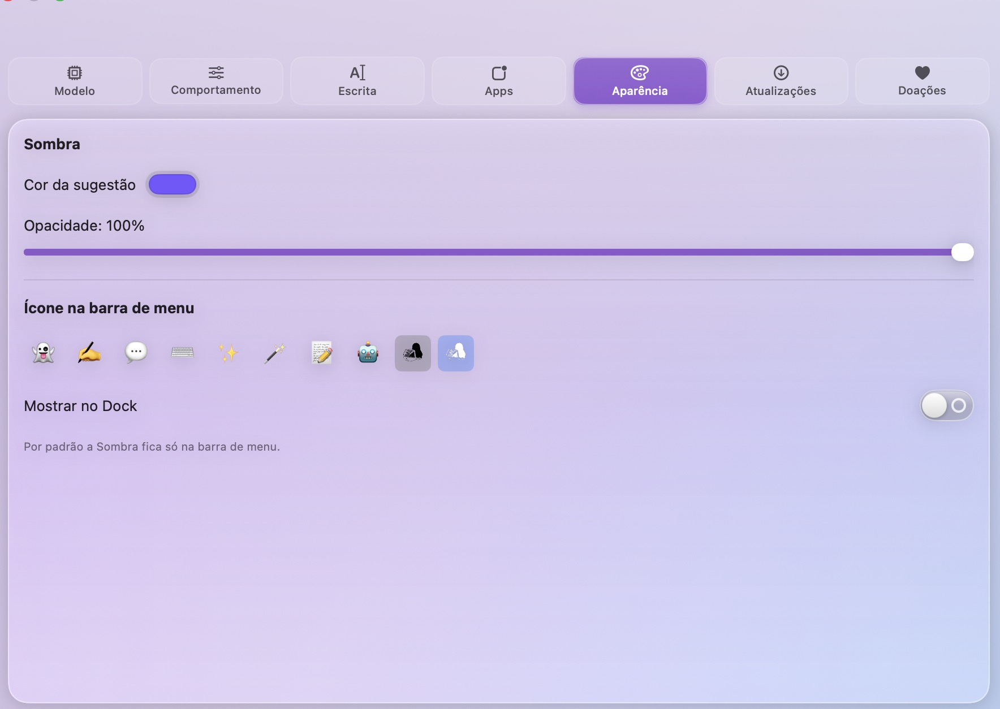

<h1>
  &nbsp; Sombra
</h1>

**Local-AI autocomplete + spell-correction for macOS.** Runs 100% on your Mac
(Apple Silicon, `llama.cpp` + Metal), lives in the menu bar, accept with **Tab**.

<p align="center">
  <br>
  <em>Type → a suggestion appears in front of the cursor → press Tab to accept.</em>
</p>

<p align="center">
  <br>
  <em>Pick &amp; download a model — glossy “Frutiger Aero” theme (translucent glass, vivid colors).</em>
</p>

<p align="center">
  
  &nbsp;
  
</p>

 [English](#english) · [Português](#português)

---

<a name="english"></a>
## English

Sombra predicts the continuation of what you're typing and shows it in a **bubble
in front of the cursor** — press **Tab** to accept. It also fixes the spelling of
the last word. Inspired by other apps of the genre, such as
[Cotabby](https://github.com/FuJacob/cotabby).

> **This is a personal project.** Anyone is free to use the app and the code. It
> was built for the **author's own everyday use**  not for general/production
> use so it may have rough edges and opinionated choices. It may receive
> **changes in the future**, with no commitment to support or stability.

### 🔒 Privacy — it stays on your machine

- Inference is **100% local** (`llama.cpp` + Metal). No cloud, no telemetry.
- Sombra makes **no network connections during normal use** — it does not phone
  home.
- It only touches the internet **on your action**: downloading a model from
  Hugging Face, or checking for app updates on GitHub. The **automatic** update
  check is **opt-in** (off by default) — you choose during setup or in Preferences.
- **Don't take my word for it:** the code is open audit it. If you'd rather be
  sure, block all of Sombra's connections with a firewall such as
  **[LuLu](https://objective-see.org/products/lulu.html)** (free & open-source),
  **Little Snitch** or **Radio Silence**. Autocomplete and correction keep working
  fully offline you just won't be able to download new models in-app (you can
  still drop `.gguf` files into the models folder manually).

### Features

- **Word-by-word autocomplete** — each **Tab** inserts only the next word.
- **Spell correction** of the last word (native macOS spell-checker, multilingual)
  — shown in **orange**; Tab replaces it. Also fixes **missing accents**
  (e.g. *voce → você*) that macOS treats as “correct”, without touching valid words.
- **Mid-text editing** — completes the word you're typing and suggests the next
  ones at word boundaries, not just at the line end.
- **Per-app rules** — block apps (e.g. password managers) and set **per-app
  prompts** (email, browser, messaging…).
- **Works in most apps**, including Electron/Chromium ones (Claude, VS Code,
  Slack…) it turns on their Accessibility tree on demand.
- **Presence indicator** — a small Sombra badge sits at the top-right of the
  focused window so you know it's active. Text suggestions appear only **after
  you start typing**, never the instant a field gets focus.
- **Screen context (OCR)** — optional: detects the app/page (email, browser,
  Reddit, GitHub…) and reads visible text so suggestions fit the context. Opt-in
  (asks for Screen Recording); off by default.
- Configurable: suggestion length, **accept shortcut**, a separate **accept-whole
  shortcut**, idle model unload (frees RAM), shadow color/opacity, menu-bar icon.
- **Optional personalization** — learns the words you use (stored locally) and
  gently favors them in suggestions, via a tunable "favor my words" dial.
- **Bilingual UI** (English / Portuguese) that follows your system language, in a
  **glossy "Frutiger Aero" theme** (translucent glass, vivid candy colors).
- **Lightweight app, no embedded model** — the app is ~16 MB; you pick and
  download a model on first launch. Curated catalog (Gemma 4 E2B *recommended*,
  Gemma 3 1B, Qwen3-1.7B, Qwen3-4B), or import any `.gguf`.
- **First-launch intro** that walks you through permissions and the model.
- **In-app updates** — check GitHub for new versions, read the changelog and
  install with one click. Automatic checking is **opt-in**.

### Requirements

- macOS 14+ and **Apple Silicon** (M1–M4)
- To build: Swift, CMake, clang (Command Line Tools or full Xcode)

### Build & run

```bash
./scripts/build_llama.sh      # build llama.cpp (libs + Metal), ~2-4 min
./scripts/bundle.sh release   # build & package Sombra.app (~16 MB, no model)
open ./build/Sombra.app        # pick & download a model on first launch
```

The app ships **without a model** (lightweight). On first launch you choose one
from the catalog and it downloads. For a headless test you can grab a small model
with `./scripts/download_model.sh` first.

Grant **Accessibility** (System Settings → Privacy & Security → Accessibility →
Sombra). That is the only permission required.

### ☕ Support

If Sombra is useful to you and you'd like to support it — totally optional:

- ☕ **Ko-fi:** https://ko-fi.com/andre38264
- 💳 **PayPal:** https://www.paypal.com/donate/?business=FF3HTRZWDV8HS&no_recurring=0&item_name=Hey+you+%3AD&currency_code=EUR
- 🇧🇷 **Pix (Brazil):** `37adbd1c-6e5e-4d2f-916a-04bc892fe496`

### License

MIT — see [LICENSE](LICENSE). © 2026 André Luís Alves Campos. Inference uses
[llama.cpp](https://github.com/ggml-org/llama.cpp) (MIT), fetched and built at
build time (not redistributed here). Models have their own licenses and are
downloaded by the user.

---

<a name="português"></a>
## Português

Autocomplete + correção ortográfica com **IA local** para macOS, inspirado em
outros aplicativos do gênero, como o [Cotabby](https://github.com/FuJacob/cotabby).
Lê o texto que você digita, prevê a continuação e mostra num **bubble** à frente
do cursor. Você aceita apertando **Tab**.

- 100% local e privado — Apple Silicon + **llama.cpp / Metal**
- Roda na **barra de menu** (sem ícone no Dock)
- Digitação fluida: event tap em **thread dedicada** + reaproveitamento de **KV-cache**

> **Sobre o projeto:** o código é aberto e **qualquer pessoa pode usar o app e o
> código** livremente. Foi pensado para **uso particular do autor**, não para uso
> geral/produção — pode conter arestas e decisões específicas. Eventualmente
> poderá receber **modificações no futuro**, sem qualquer compromisso de suporte.

### 🔒 Privacidade — fica tudo na sua máquina

- A inferência é **100% local** (`llama.cpp` + Metal). Sem nuvem, sem telemetria.
- A Sombra **não faz nenhuma conexão de rede no uso normal** — não "liga pra casa".
- Só acessa a internet **por ação sua**: baixar um modelo do Hugging Face ou
  verificar atualizações no GitHub. A verificação **automática** é **opcional**
  (desligada por padrão) — você escolhe na introdução ou nas Preferências.
- **Não precisa confiar na minha palavra:** o código é aberto — verifique. Se
  preferir garantir, bloqueie todas as conexões da Sombra com um firewall como
  **[LuLu](https://objective-see.org/products/lulu.html)** (grátis e
  open-source), **Little Snitch** ou **Radio Silence**. O autocomplete e a
  correção continuam funcionando **offline** — você só não conseguirá baixar
  modelos pelo app (mas pode colocar arquivos `.gguf` na pasta manualmente).

### Recursos

- **Autocomplete palavra-por-palavra** — cada **Tab** insere só a próxima palavra.
- **Correção ortográfica** (NSSpellChecker, multilíngue) — mostra a correção da
  última palavra em **laranja**; o **Tab** substitui. Também pega **falta de
  acento** (ex.: *voce → você*) que o macOS considera “correta”, sem mexer em
  palavras válidas. Sem custo do modelo (instantâneo).
- **Edição no meio do texto** — completa a palavra que você está digitando e
  sugere as próximas nas fronteiras de palavra.
- **Bubble** na frente do cursor (no fim da linha) ou acima dele (editando no
  meio), pra ficar sempre visível sem cobrir o texto.
- **Funciona na maioria dos apps**, incluindo Electron/Chromium (Claude, VS Code,
  Slack…). *Obs.:* nesses, a posição do cursor é imprecisa (limitação do macOS).
- **Indicador de presença** — um pequeno badge da Sombra no canto da janela em
  foco. As sugestões só aparecem **depois que você começa a digitar**.
- **Contexto da tela (OCR)** — opcional: detecta o app/página (email, navegador,
  Reddit, GitHub…) e lê o texto visível pra sugestões mais no contexto. Opt-in
  (pede Gravação de Tela); desligado por padrão.
- **Personalização opcional** — aprende as palavras que você usa (guardadas
  localmente) e as favorece nas sugestões, com um controle de intensidade.
- **Atalhos configuráveis** (aceitar palavra-por-palavra e aceitar a frase
  inteira), descarregar modelo ocioso, e **introdução** na primeira abertura.
- **App leve, sem modelo embutido** (~16 MB) — você escolhe e baixa o modelo no
  início. Catálogo: **Gemma 4 E2B** (recomendado), Gemma 3 1B, Qwen3-1.7B,
  Qwen3-4B — ou importe qualquer `.gguf`.
- **Tema glossy "Frutiger Aero"** (vidro translúcido, cores vivas) em claro/escuro.
- **Atualizações no app** — verifica novas versões no GitHub, mostra o changelog
  e instala com um clique. A verificação automática é **opcional**.

### Preferências (👻 na barra de menu → "Preferências…", ⌘,)

- **Modelo** — escolher o ativo (inclui a base embutida), **baixar** do catálogo
  (com tamanho, descrição e requisito de hardware), **importar** ou **apagar**
  `.gguf`. Modelos em `~/Library/Application Support/Sombra/models`.
- **Aparência** — nº de palavras por sugestão (1–10), cor e opacidade da sombra,
  remover ponto final, e o **emoji** do ícone na barra de menu.
- **Escrita** — lista de **prompts** (estilo/idioma) que dão contexto ao modelo,
  com sugestões prontas.
- **Apps** — **bloquear apps** (não lê/sugere) e **prompts por app**.

A **interface é bilíngue** (inglês / português) e segue o idioma do sistema.

Na barra de menu também há **"Desativar neste app"**, para bloquear rapidamente o
app em foco.

### Requisitos

- macOS 14+ e **Apple Silicon** (M1–M4)
- Para compilar: Swift, CMake, clang (Command Line Tools ou Xcode)

### Setup completo

```bash
./scripts/build_llama.sh      # compila o llama.cpp (libs + Metal), ~2-4 min
./scripts/bundle.sh release   # compila e empacota o Sombra.app (~16 MB, sem modelo)
open ./build/Sombra.app        # escolha e baixe um modelo na 1ª abertura
```

O app vem **sem modelo** (leve). Na primeira abertura você escolhe um do catálogo
e ele baixa. Para teste sem GUI, baixe um modelo pequeno antes com
`./scripts/download_model.sh`.

Conceda a **Acessibilidade** (Ajustes do Sistema → Privacidade e Segurança →
Acessibilidade → Sombra). É a única permissão necessária. Como o app é assinado
*ad-hoc*, ao atualizar o binário pode ser preciso reconceder.

### Arquitetura

| Componente | Arquivo | Papel |
|---|---|---|
| Entrada/menu bar | `main.swift`, `AppDelegate.swift`, `StatusBarController.swift` | App `.accessory`; toggle, status, "Desativar neste app" |
| Leitura de texto | `AXReader.swift` | Janela de texto perto do cursor + posição + app dono (Accessibility) |
| Captura do Tab | `KeyTap.swift` | `CGEventTap` em **thread dedicada**; consome o Tab via flag atômica |
| Bubble | `GhostOverlay.swift` | `NSPanel` à frente do cursor (cor configurável / laranja na correção) |
| Indicador | `IndicatorOverlay.swift` | Badge da Sombra no canto da janela; presença ativa (sugestão só após digitar) |
| Inserção | `TextInjector.swift` | Digita/substitui via CGEvent Unicode + Backspace (eventos marcados) |
| Orquestração | `SuggestionEngine.swift` | Loop orientado a evento: ler → prever → mostrar → aceitar |
| Inferência | `LlamaPredictor.swift`, `Sources/CLlama/` | Shim C sobre llama.cpp + KV-cache |
| Correção | `SpellCorrector.swift` | NSSpellChecker (multilíngue) da última palavra |
| Preferências/GUI | `SombraSettings.swift`, `SettingsView.swift`, `SettingsWindowController.swift` | Estado persistido + janela SwiftUI |
| Modelos | `ModelManager.swift`, `ModelCatalog.swift`, `ModelLocator.swift` | Baixar/importar/apagar/localizar `.gguf` |
| Atualizações | `Updater.swift`, `UpdateView.swift` | Verifica releases do GitHub, baixa o `.dmg` e troca o app (opt-in) |

```
digitação (thread do tap, não bloqueia)
   → ao PAUSAR (~70 ms) → AXReader lê janela do texto + posição + app
   → app bloqueado? descarta. senão:
   → Predictor.predict() em background (KV-cache reutiliza o prefixo)
   → tem continuação?  bubble (autocomplete)
       senão  última palavra errada?  bubble laranja (correção)
   → Tab → consome → TextInjector insere a palavra (ou substitui na correção)
```

### Por que llama.cpp (e não MLX)?

O MLX exige o compilador Metal do **Xcode completo** em tempo de build. O
llama.cpp compila os shaders Metal em **runtime** (`GGML_METAL_EMBED_LIBRARY`),
então roda só com o Command Line Tools — e entrega a mesma velocidade em modelos
pequenos no Apple Silicon. Reaproveita o **KV-cache** entre teclas (decodifica só
os tokens novos), o que mantém a latência baixa em textos longos.

### ☕ Apoie

Se a Sombra for útil pra você e quiser apoiar — totalmente opcional:

- ☕ **Ko-fi:** https://ko-fi.com/andre38264
- 💳 **PayPal:** https://www.paypal.com/donate/?business=FF3HTRZWDV8HS&no_recurring=0&item_name=Hey+you+%3AD&currency_code=EUR
- 🇧🇷 **Pix:** `37adbd1c-6e5e-4d2f-916a-04bc892fe496`

### Roadmap

- [x] Correção ortográfica da última palavra (NSSpellChecker, multilíngue)
- [x] Avaliação orientada a evento (sem polling pesado na main thread)
- [x] Bloquear apps + prompts por app
- [x] KV-cache reuse entre teclas
- [x] Preferências persistidas + GUI
- [x] Atualização no app pelo GitHub (verificação automática opcional)
- [ ] Modo corretor gramatical de frase (via chat template)
- [ ] Acompanhar fonte/tamanho do app alvo na sombra
- [ ] Teardown limpo do Metal ao sair

## License / Licença

MIT — see [LICENSE](LICENSE). © 2026 André Luís Alves Campos.
